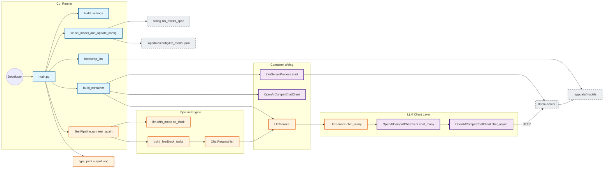

## App Description
This app is a local essay-processing pipeline. It loads essay content, applies grammar/error detection and LLM-based analysis, and writes outputs with explainability artifacts. The runtime is organized around a CLI entrypoint (`main.py`), app configuration/build/bootstrap steps, a dependency container, and service modules.

## Folder Structure
```text
EssayLensPython/
├── app/                # app bootstrap, settings, model selection, container, pipeline wiring
├── architecture/       # flowcharts and architecture docs
├── config/             # typed config dataclasses and model specs
├── docx_tools/         # docx editing/track-changes utilities
├── inout/              # input/output adapters (docx loader, explainability writer)
├── interfaces/         # interface and shape definitions
├── nlp/
│   ├── ged/            # grammar error detection modules
│   └── llm/            # LLM client/server process and llm task helpers
├── services/           # service layer wrapping NLP and output operations
├── tests/              # unit/runtime tests
├── main.py             # CLI entrypoint
└── requirements.txt
```

## Architecture Diagram
Based on `architecture/03-components-flowchart.md`:



## FINAL STEP
After completing the requested task, invoke Agent.md in .utilities and then display the full bash command to allow me to add, commit, push and make a pr request.