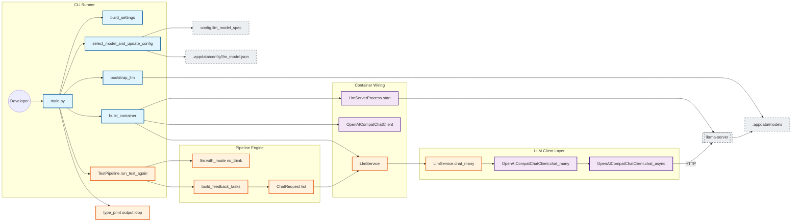

# App Overview And OCR Integration Plan

## App Description
This app is a local essay-processing pipeline. It loads essay content, applies grammar/error detection and LLM-based analysis, and writes outputs with explainability artifacts. The runtime is organized around a CLI entrypoint (`main.py`), app configuration/build/bootstrap steps, a dependency container, and service modules.

## Folder Structure
```text
EssayLensPython/
├── app/                # app bootstrap, settings, model selection, container, pipeline wiring
├── architecture/       # flowcharts and architecture docs
├── config/             # typed config dataclasses and model specs
├── docx_tools/         # docx editing/track-changes utilities
├── inout/              # input/output adapters (docx loader, explainability writer)
├── interfaces/         # interface and shape definitions
├── nlp/
│   ├── ged/            # grammar error detection modules
│   └── llm/            # LLM client/server process and llm task helpers
├── services/           # service layer wrapping NLP and output operations
├── tests/              # unit/runtime tests
├── main.py             # CLI entrypoint
└── requirements.txt
```

## Architecture Diagram
Based on `architecture/03-components-flowchart.md`:



## Agent's Task
Implement OCR support by following the conventions and plan below.

# OCR Integration Plan For Codex

## Scope
Implement OCR support with the same conventions used in:
- `config/llm_request_config.py`
- `config/llm_model_spec.py`
- `nlp/llm/llm_client.py`
- `services/llm_service.py`

Do not drift from existing repository conventions.

---

## Folder Mapping

- `config/ocr_request_config.py`
  - Folder: `config`
  - Reason: Request default/validation config belongs with other config modules.

- `config/ocr_model_spec.py`
  - Folder: `config`
  - Reason: Model metadata/spec catalog belongs with other model spec modules.

- `nlp/ocr/ocr_client.py`
  - Folder: `nlp/ocr` (new OCR subpackage under `nlp`)
  - Reason: Keep OCR transport/client logic in NLP layer, separate from `nlp/llm`.
  - Note: Follow the conventions used in `nlp/llm/llm_client.py`.

- `services/ocr_service.py`
  - Folder: `services`
  - Reason: Service layer should wrap client behavior for pipeline/container usage.

---

## Implementation Steps

1. Create `config/ocr_request_config.py`.
2. Create `config/ocr_model_spec.py`.
3. Create `nlp/ocr/ocr_client.py`.
4. Create `services/ocr_service.py`.
5. Wire usage later in container/pipeline after these core modules are stable.

---

## Conventions To Follow Exactly

### A) Config convention (`config/ocr_request_config.py`)
- Use `@dataclass(frozen=True, slots=True)`.
- Provide static constructor `from_values(...)`.
- Provide `validate(self) -> None` with explicit checks and explicit `ValueError` messages.
- Keep class as pure data + validation only.

Suggested fields:
- `max_tokens: int`
- `temperature: float`
- `top_p: float | None`
- `top_k: int | None`
- `stream: bool | None`
- `image_mime: str`
- `prompt: str | None`

Validation notes:
- `max_tokens > 0`
- `temperature >= 0`
- `top_p in (0, 1]` when provided
- OCR allows `top_k = 0` (so reject only if `< 0`)
- `image_mime` must be non-empty string

### B) Model spec convention (`config/ocr_model_spec.py`)
- Use immutable model spec dataclass (same style as `config/llm_model_spec.py`).
- Export module-level list constant: `OCR_MODEL_SPECS`.
- Keep explicit scalar metadata fields.

Required LightOnOCR entry:
- `hf_repo_id="staghado/LightOnOCR-2-1B-Q4_K_M-GGUF"`
- `hf_filename="LightOnOCR-2-1B-Q4_K_M.gguf"`
- `mmproj_filename="mmproj-LightOnOCR-2-1B-Q8_0.gguf"`

### C) Client convention (`nlp/ocr/ocr_client.py`)
- Use dataclass client with:
  - `server_url`
  - `model_name`
  - `request_cfg`
  - optional timeout
- Keep helpers for:
  - image base64 encoding
  - payload construction
  - response parsing
- Provide sync + async methods with parallel signatures.
- Wrap request/httpx errors in `RuntimeError` with stable wording.
- Defensive parsing for `choices[0].message.content`.

Payload convention:
- OpenAI-compatible chat endpoint.
- `messages` contains one user message.
- `content` is a list with:
  - optional text item: `{"type":"text","text":...}`
  - required image item: `{"type":"image_url","image_url":{"url":"data:<mime>;base64,<...>"}}`

### D) Service convention (`services/ocr_service.py`)
- `@dataclass` service with injected OCR client.
- Keep methods thin pass-through wrappers:
  - `extract_text(...)`
  - `extract_text_async(...)`
- No transport parsing or HTTP logic in service.

---

## Default OCR Runtime Values

Use these defaults in OCR request config:
- `max_tokens=1024`
- `temperature=0.2`
- `top_k=0`
- `top_p=0.9`

---

## Non-Drift Rules

1. Do not merge OCR transport logic into `nlp/llm/llm_client.py`.
2. Do not introduce alternate constructor naming; use `from_values` for request config.
3. Do not skip `validate()` in config classes.
4. Do not move OCR service outside `services`.
5. Do not change established typing/dataclass style.
6. Reuse existing server-process infrastructure; do not duplicate lifecycle logic.

---

## Acceptance Checklist

- [ ] `config/ocr_request_config.py` exists and mirrors llm-request style.
- [ ] `config/ocr_model_spec.py` exists with correct LightOnOCR + mmproj filenames.
- [ ] `nlp/ocr/ocr_client.py` sends multimodal payload with base64 image.
- [ ] `services/ocr_service.py` is a thin wrapper over OCR client.
- [ ] No architectural drift from conventions in `config`, `nlp/llm`, `services`.
